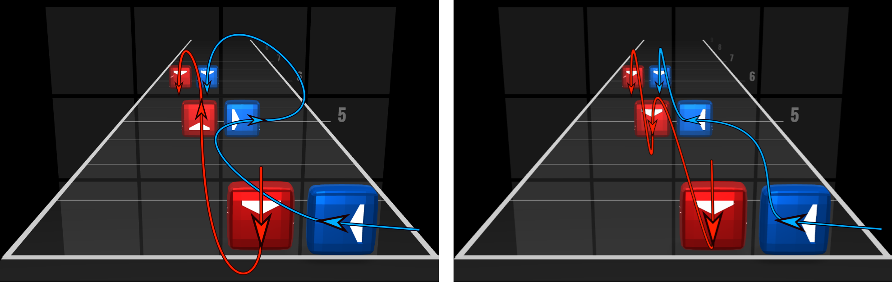

# DeepSaber: Deep Learning for high dimensional choreography

This project requires Python 3.8+, TF 2.2+ (recommended TF 2.3). See `Dockerfile`.

- All settings and hyperparameters are set in `src/utils/types.py`
- For explanatory notebooks see `src/notebooks`
- For experiments see `src/experiments` or run `src/run_experiments.py`
- To train, evaluate and generate action placement for beat maps by hand, modify and run `src/experiment_by_hand.py`

- `research` is for previous iterations and experimentation during development  
- Links to songs used for comparison of this project, OxAI DeepSaberv2 and Beat Sage are in `data/evaluation_dataset/song_urls.txt`

## How to set up this project
1. Download OxAI or your own beat maps
2. Unzip them in `data/human_beatmaps/new_dataformat` 
    - Or change `config.dataset.beat_maps_folder`
3. Run `src/generate_initial_dataset.py` (
    - `data/new_dataformat` (as set in `config.dataset.storage_folder`) with pickled DataFrames should be created
4. Run `src/notebooks/create_action_embeddings.ipynb`
    - FastText action embeddings should be created
5. Run `src/generate_initial_dataset.py` again, or start experimenting with `src/experiment_by_hand.py`
6. The project is ready for usage
    1. Explore data set in `src/notebooks/data_exploration.ipynb`
    2. Experiment by hand with `src/experiment_by_hand.py`
    3. Run the experiments `src/run_experiments.py` (takes long, long time)
    4. Explore results in `src/notebooks/results_exploration.ipynb`
    
## Contributions
- Beat maps are sentences; actions are words
    - Use Word2Vec and FastText to create action embeddings
    - Dataset of action analogies
- Evaluation of new features for _Learning to choreograph_
    - Part of the song, difficulty, MFCC, etc.
- [Multi LSTM architecture](misc/multi_lstm.pdf)
    - Handles well multiple different input streams
- Local metric based on action embeddings
- Global metric to measure the similarity between human a synthetic choreography based on the distribution of new actions.

### Previous DeepSaber version:

Video of the current version coming soon.